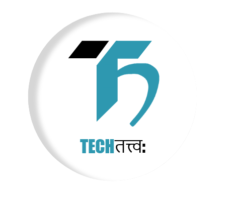
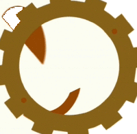
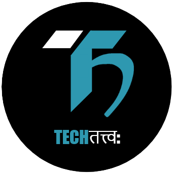

# Techtatva

<p align="center">

</p>
<p>
This is the website built for Techtatva event by Aavesh IIITU.
</p>

<hr>

## IIIT Una

Indian Institute of Information Technology Una (IIIT, Una) is one of the Indian Institutes of Information Technology located at Vill. Saloh, Teh. Haroli, Distt. Una Himachal Pradesh

<p align="center">

</p>

## Aavesh

Aavesh is the core electronics society of IIITU that strives to teach and help students acquire new skills in an era of rapidly evolving technology in the field of electronics and communication engineering.

<p align="center">

</p>

## Techtatva

Techtatva is the technical and social event conducted by AAVESH, IIIT Una. It marks days of absolute ecstasy providing participants a competing platform in technical, non-technical and some fun events.

<p align="center">

</p>

## For local developent

### Clone the repository in you local machine

```sh
git clone https://github.com/akshatmittal61/techtatva.git
```

### Enter the 'techtatva' directory

```sh
cd techtatva
```

### Install the dependencies

```sh
npm i
```

### Start the local dev server

```sh
npm start
```

Open [http://localhost:3000](http://localhost:3000) in your browser to view the website

## Author

[Akshat Mittal](https://github.com/akshatmittal61)
